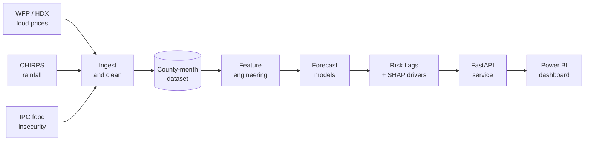

<div align="center">

# Kenya Food Security Early-Warning System

### Forecasting staple food prices and flagging county-level risk, built on open data


**[Overview](#overview)** &nbsp;|&nbsp; **[Objectives](#objectives)** &nbsp;|&nbsp; **[Architecture](#architecture)** &nbsp;|&nbsp; **[Data](#data-sources)** &nbsp;|&nbsp; **[Method](#methodology)** &nbsp;|&nbsp; **[Roadmap](#roadmap)** &nbsp;|&nbsp; **[Get started](#getting-started)**

</div>

---

## Overview

Maize and beans are Kenya's key staple foods, and sharp price rises hit households in the arid and semi-arid lands (ASALs) first. Price and food-insecurity information exists, but it sits in separate sources and is mostly **retrospective**: users see a spike after it has happened.

This project builds a **cloud-based early-warning platform** that:

- integrates open price, rainfall and food-insecurity data into one **county-level monthly dataset**;
- **forecasts** monthly maize, bean and rice prices one to three months ahead;
- assigns each county a **low, medium or high price-spike risk flag**, with the main drivers explained;
- serves the results through a **REST API** and an **interactive dashboard**.

> **Status:** in development. The repository currently contains the project setup. Features below are planned, and the [roadmap](#roadmap) tracks what is done.

---

## The problem

| # | Problem | Why it matters |
|---|---------|----------------|
| 1 | Price information is reported after the fact, not forecast | Decision makers have little time to plan stock releases or cash transfers |
| 2 | Prices, rainfall and food-insecurity data sit in separate sources | Combining them by hand takes time and technical skill |
| 3 | There is no accessible, explainable risk signal at county level | Users cannot see which counties are likely to be hit next, or why |
| 4 | Manual monitoring capacity is under pressure | Automated, low-cost pipelines are increasingly important |

---

## Objectives

### System objectives

1. **Integrate** WFP/HDX prices, CHIRPS rainfall and IPC data into one county-level monthly dataset, refreshed monthly without manual work.
2. **Forecast** maize, bean and rice prices 1 to 3 months ahead with a lower mean absolute error than a seasonal-naive baseline on a held-out test period.
3. **Classify** each county every month as low, medium or high price-spike risk, and show the top contributing factors.
4. **Serve** forecasts and risk flags through a REST API (target: 95% of requests under 2 seconds) and an interactive dashboard.

### Research objectives

1. Investigate existing food price monitoring and early-warning systems in Kenya and identify their gaps.
2. Establish the information needs of prospective users (county officers, NDMA, NGO and UN analysts, grain traders).
3. Analyse historical price and rainfall data for seasonality, shocks and lagged relationships.
4. Design, develop and evaluate forecasting models and the risk-flag method.
5. Deploy the system on cloud infrastructure and test it with users.

---

## Architecture



---

## Data sources

All inputs are open and publicly available. Each source keeps its own licence and terms of use, which will be checked and respected.

| Data | Provider | Used for | Link |
|------|----------|----------|------|
| Kenya food prices | WFP, via the Humanitarian Data Exchange | Target variable and lagged features | [HDX dataset](https://data.humdata.org/dataset/wfp-food-prices-for-kenya) |
| Acute food insecurity | IPC | Validating risk flags | [IPC Kenya](https://www.ipcinfo.org/ipc-country-analysis/details-map/en/c/1161211/?iso3=KEN) |
| Rainfall | CHIRPS, UC Santa Barbara Climate Hazards Center | Climate features | [CHIRPS](https://www.chc.ucsb.edu/data/chirps) |
| County market prices (optional) | Kenya Agricultural Market Information System | Supplementary county-level prices | [KAMIS](https://kamis.kilimo.go.ke) |
| Real-time prices (optional) | World Bank | Gap checking, clearly labelled where estimated | [Microdata library](https://microdata.worldbank.org) |

**Known data caveat:** WFP prices are recorded by **market**, not county, so a market-to-county mapping is part of the pipeline, and coverage varies by market and period.

---

## Methodology

**Development approach.** The Spiral model, with CRISP-DM inside each iteration: business understanding, data understanding, data preparation, modelling, evaluation, deployment.

| Iteration | Focus | Main risks addressed |
|-----------|-------|----------------------|
| 1 | Requirements, data pipeline, data-quality assessment, baseline model | Data gaps, market-to-county mapping errors |
| 2 | Forecasting models, risk flag, explanations | Models not beating baseline, unclear spike definition |
| 3 | API, dashboard, cloud deployment, testing | Cloud cost and delays, usability |

**Forecasting and evaluation**

- Baseline: seasonal-naive forecast. Every model is compared against it.
- Candidate models: Prophet (or ARIMA) and gradient boosting (XGBoost) with lagged price and rainfall features.
- Validation: time-based train, validation and test splits with rolling-origin evaluation, so models are always tested on later data than they trained on.
- Metrics: MAE, RMSE and MAPE.

**Risk flag (draft definition).** A county is flagged by comparing its forecast price with its trailing 12-month average (for example, high risk if more than 20% above). The threshold will be tested during analysis and documented. Feature contributions are explained with SHAP values, and flags are checked against IPC data where coverage allows.

---

## Tech stack

| Layer | Tools |
|-------|-------|
| Data and analysis | Python, pandas, NumPy, SQL |
| Modelling | scikit-learn, statsmodels, Prophet, XGBoost, SHAP |
| Service | FastAPI, Uvicorn |
| Quality | pytest, GitHub Actions |
| Packaging and cloud | Docker, Microsoft Azure |
| Visualisation | Power BI, matplotlib |

---

## Repository structure

```text
food-security-ews/
├── data/
│   ├── raw/            # downloaded source files (not committed)
│   └── processed/      # cleaned county-month datasets (not committed)
├── notebooks/          # exploration, features, models, risk flags
├── src/
│   ├── ingest/         # download and cleaning scripts
│   ├── features/       # feature engineering
│   ├── models/         # baseline, forecasting models, risk flag
│   └── api/            # FastAPI service
├── tests/              # automated tests
├── dashboards/         # Power BI file and screenshots
├── requirements.txt
└── README.md
```

---

## Getting started

**Requirements:** Python 3.10 or newer and Git.

```bash
# 1. Clone the repository
git clone https://github.com/ombonye-code/food-security-ews.git
cd food-security-ews

# 2. Create and activate a virtual environment
python -m venv .venv
.venv\Scripts\Activate.ps1        # Windows (PowerShell)
# source .venv/bin/activate       # macOS / Linux

# 3. Install dependencies
pip install -r requirements.txt

# 4. Check the install
python -c "import pandas, sklearn, xgboost, shap, fastapi; print('ready')"
```

Data download and model scripts will be added as the roadmap progresses.

---

## Roadmap

Planned over 11 weeks from 5 October 2026.

| Phase | What happens | Weeks | Status |
|-------|--------------|-------|--------|
| 0. Setup | Repository, folder structure, environment, first commit | W1 | ✅ Done |
| 1. Data | Download, inspect and clean prices; market-to-county mapping; merge rainfall | W1 to W2 | ⬜ Planned |
| 2. Requirements | User survey and interviews; SRS | W2 to W3 | ⬜ Planned |
| 3. Analysis and models | Exploration, baseline, forecasting models, risk flag, SHAP | W4 to W7 | ⬜ Planned |
| 4. Engineering | FastAPI service, Docker, tests, CI, Power BI dashboard | W7 to W9 | ⬜ Planned |
| 5. Deployment and testing | Azure deployment, scheduled refresh, user testing | W8 to W10 | ⬜ Planned |
| 6. Documentation | Design, test, deployment and maintenance plans, user manual, final report | W3 to W11 | ⬜ Planned |

---

## Limitations and responsible use

- This is a **decision-support tool**, not a replacement for official food security assessments.
- Forecast accuracy depends on data quality and cannot anticipate shocks such as policy changes, conflict or global price movements.
- Some counties may have sparse price history and may be excluded or flagged as low-confidence.
- The project uses only open, aggregated data and contains no personal information.
- If a model does not beat the baseline, the results will say so.

---

## Author

**Frank Ombonye**
BSc Information Technology (Data Science), KCA University, Nairobi, Kenya
GitHub: [@ombonye-code](https://github.com/ombonye-code)

---

## Acknowledgements and data attribution

Food price data: World Food Programme (via HDX). Food insecurity data: Integrated Food Security Phase Classification (IPC). Rainfall data: Climate Hazards Group InfraRed Precipitation with Station data (CHIRPS), UC Santa Barbara Climate Hazards Center. All data remains the property of its providers and is subject to their terms of use.
